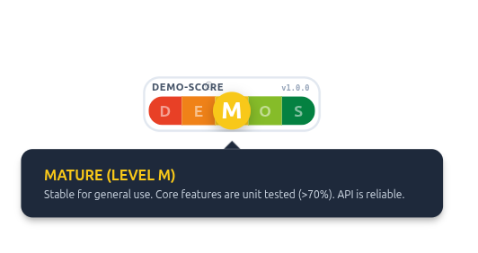
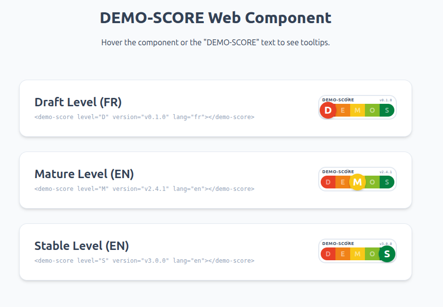

# DEMO-SCORE

<p align="center">
  
</p>

<p align="center">
  
</p>

A visual maturity indicator for modern web components. DEMO-SCORE acts as a "Nutri-Score" for apps, providing 100% transparency on the maturity level of the underlying code and structure.

Maintained by **hand-e**.

## Why?

In 2026, it is incredibly easy to generate beautiful UIs using AI, even if the underlying logic, performance, or tests don't exist yet ("Sand foundations"). 
DEMO-SCORE aims to be the open-source community standard for signaling the real maturity of a piece of code, directly on the interface.

## Installation & Usage

Because DEMO-SCORE is a **Vanilla Web Component**, it requires **zero dependencies** and works out of the box in React, Vue, Svelte, Angular, or Vanilla HTML!

### 1. Installation

The recommended way for modern projects (React, Vue, Angular, etc.) is via NPM:

```bash
npm install @hand-e/demo-score
```

Then, import it once in your application entry point (`main.js`, `index.js`, or `App.vue`):

```javascript
import '@hand-e/demo-score';
```

#### Alternative: Via CDN (Vanilla HTML)

```html
<!-- Via NPM CDN -->
<script src="https://cdn.jsdelivr.net/npm/@hand-e/demo-score/demo-score.js"></script>

<!-- Or directly from a specific version/branch on the GitHub repository via jsDelivr -->
<script src="https://cdn.jsdelivr.net/gh/hand-e-fr/demo-score@main/demo-score.js"></script>
```

### 2. Check the Examples

We have provided ready-to-use examples for various frameworks in the `examples/` directory:
- **Vanilla HTML**: Open `examples/vanilla-html/index.html` directly in your browser. Or view it online: [Live Vanilla HTML Preview](https://htmlpreview.github.io/?https://github.com/hand-e-fr/demo-score/blob/main/examples/vanilla-html/index.html)
- **React**: Navigate to `examples/react/`
- **Vue 3**: Navigate to `examples/vue/`
- **Angular**: Navigate to `examples/angular/`

### 3. Use it anywhere

```html
<demo-score level="M" version="v1.0.0" lang="en"></demo-score>
```

### Attributes

| Attribute | Description | Default |
|-----------|-------------|---------|
| `level`   | Maturity level (`D`, `E`, `M`, `O`, `S`). See details below. | `D` |
| `version` | Text displayed in the top right corner. | `v1.0.0`|
| `lang`    | Language for the tooltips (`en`, `fr`, `es`, `de`, `it`, `pt`, `ru`, `ar`, `zh`, `ja`, `ko`, `hi`). | `en` |

## The 5 Maturity Levels

* **D (Draft)**: Proof of concept. Unstable API subject to breaking changes. Not for production.
* **E (Evolving)**: Main functionality in place. Subject to adjustments and refactoring.
* **M (Mature)**: Stable for general use. Core features are unit tested (>70%). API is reliable.
* **O (Optimized)**: Performance verified and documentation complete. Follows industry best practices.
* **S (Stable)**: Production-ready with LTS support. Accessibility and performance fully validated.

## Theming & Customization

The component encapsulates its internal styles using the Shadow DOM, but you can deeply customize its appearance using **CSS Variables**. This is especially useful for **Dark Mode** support.

### CSS Variables

| Variable | Default | Purpose |
|----------|---------|---------|
| `--demo-score-scale` | `10px` | Base font-size. Increase this to scale the entire component. |
| `--demo-score-bg` | `white` | Background color of the main pill. |
| `--demo-score-border` | `#e2e8f0` | Border color of the main pill. |
| `--demo-score-text` | `#475569` | Color of the "DEMO-SCORE" text. |
| `--demo-score-tooltip-bg` | `#1e293b` | Background of the tooltips. |
| `--demo-score-tooltip-text`| `white` | Main text inside tooltips. |

**Example: Dark Mode implementation**

```css
/* In your app's global CSS */
.dark-theme demo-score {
  --demo-score-bg: #0f172a;
  --demo-score-border: #334155;
  --demo-score-text: #e2e8f0;
  --demo-score-version-text: #64748b;
  --demo-score-tooltip-bg: #1e293b;
  --demo-score-tooltip-border: #475569;
}
```

**Example: Scaling the component**

Because the component uses relative `em` units, you can easily scale it up or down:

```css
demo-score {
  /* Makes the widget 50% larger */
  --demo-score-scale: 15px; 
}
```

## Accessibility (a11y)

DEMO-SCORE is fully accessible:
* **Keyboard Navigation:** You can `Tab` to the component. It exposes a custom focus ring.
* **Screen Readers:** Generates a dynamic `aria-label` detailing the current maturity status.
* **Tooltips:** Tooltips appear on both mouse hover (`mouseenter`) and keyboard focus (`focus`).
